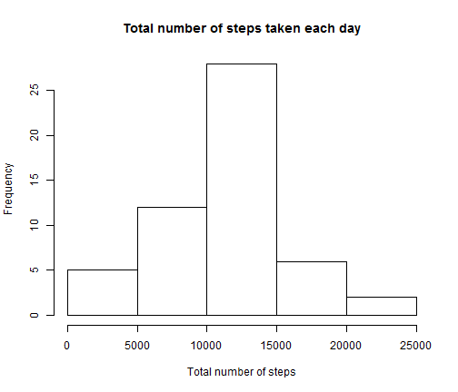
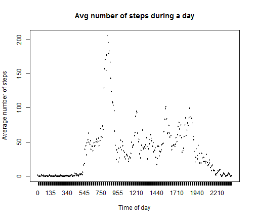
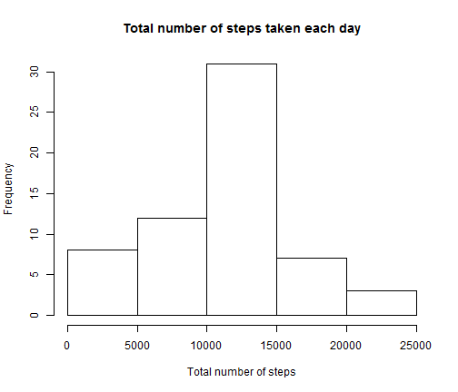
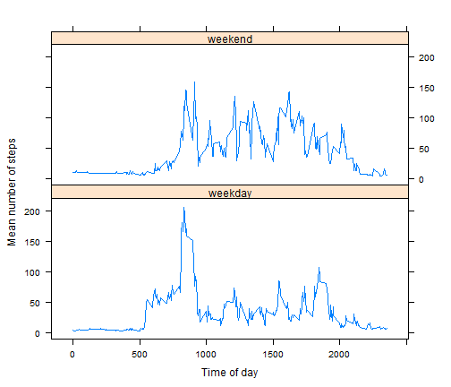

Reproducible Research - Peer Assessment 1
========================================================

We first set the working dicrectory to be `setwd("C:/Users/pc2/SkyDrive/Coursera/Data Science/Reproducible Research")`.

We read in the data and then determine the total number of steps taken each day.


```r
activity <- read.csv("activity.csv",header=TRUE,sep=",")
noofstepsbyday <- sapply(split(activity$steps,activity$date),sum)
```

We next plot a histogram for the above data.


```r
hist(as.numeric(noofstepsbyday),main="Total number of steps taken each day",xlab="Total number of steps")
```

 


The mean of the number of steps taken each day is 1.0766 &times; 10<sup>4</sup> and the median of the steps taken each day is 10765.


```r
activity$intervalsteps <- as.factor(activity$interval)
noofstepsbyinterval <- aggregate(steps ~ intervalsteps, activity, mean)
```

A plot showing the average number of steps taken at each interval of the day is shown below.


```r
plot(noofstepsbyinterval$intervalsteps,noofstepsbyinterval$steps,type="l",main="Avg number of steps during a day",xlab="Time of day",ylab="Average number of steps")
```

 


The maximun number of steps taken in a 5 minute interval begins at 835 in the morning.

Imputing missing values
----------------------------------

```r
setwd("C:/Users/pc2/SkyDrive/Coursera/Data Science/Reproducible Research")
activity <- read.csv("activity.csv",header=TRUE,sep=",")
cc <- activity[complete.cases(activity),]
TotalMissingValues <- nrow(activity) - nrow(cc)
```

The number of rows in the original data set is 17568 and of these 2304 have missing values.

We replace the missing value for the specific time interval with the mean for that time interval as calculated above. We then create a new data set that contains the replaced values instead of missing values.


```r
notcompletecases <- activity[!complete.cases(activity),]
temp <- merge(notcompletecases,noofstepsbyinterval,by.x="interval",by.y="intervalsteps")
notcompletecases$steps <- temp$steps.y
completecases <- activity[complete.cases(activity),]
activity_new <- rbind(completecases,notcompletecases)
```

For this dataset with the imputed values, we plot a histogram as shown below.


```r
noofstepsbyday_new <- sapply(split(activity_new$steps,activity_new$date),sum)
hist(as.numeric(noofstepsbyday_new),main="Total number of steps taken each day",xlab="Total number of steps")
```

 

After replacing the missing values with the mean of the values for those specific intervals, the mean of the number of steps taken each day is 1.0766 &times; 10<sup>4</sup> and the median of the steps taken each day is 1.1015 &times; 10<sup>4</sup>.

We want to find differences in activity patterns between weekdays and weekends. To develop this analysis, we add a new column to decide if a particular date is a weekday or weekend. Then we create a new data set that calculates the mean number of steps taken in each 5 minute interval of the day.


```r
activity_new$day <- weekdays(as.Date(activity_new[,"date"]),abbreviate=TRUE)
weekends <- subset(activity_new,day=="Sat"|day=="Sun")
weekdays <- subset(activity_new,day=="Mon"|day=="Tue"|day=="Wed"|day=="Thu"|day=="Fri")
weekends$weekend <- "weekend"
weekdays$weekend <- "weekday"
activity_new <- rbind(weekdays,weekends)
meanactivitysteps <- aggregate(steps ~ interval + weekend,data=activity_new,mean)
```
The following panel plot shows the distribution of the average number of steps across time on weekdays and weekends.

```r
library(lattice)
xyplot(meanactivitysteps$steps ~ meanactivitysteps$interval | meanactivitysteps$weekend,layout=c(1,2),type="l",xlab="Time of day",ylab="Mean number of steps")
```

 


